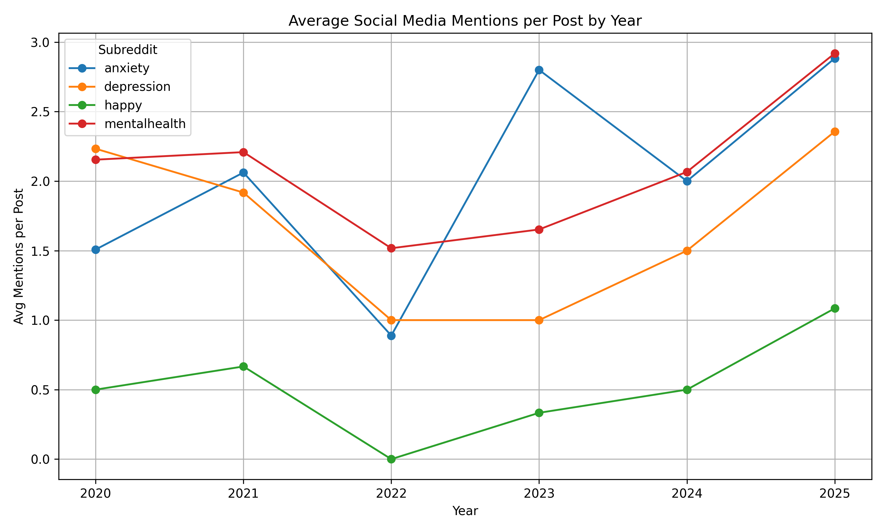
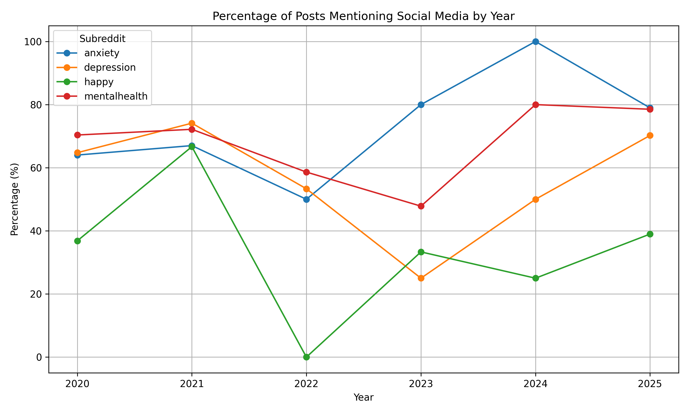
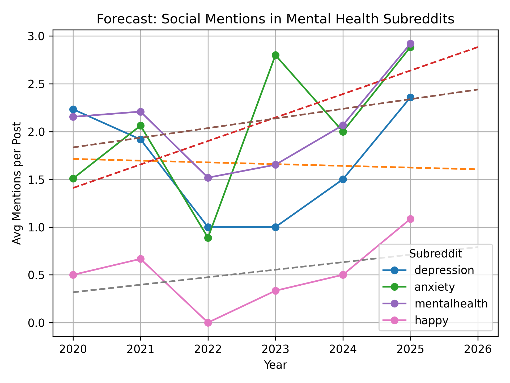

# Reddit Mental Health & Social Media Analysis 📊

This project explores the presence and growth of social media discussions in mental health-related subreddits over time. It fetches Reddit data, analyzes keyword mentions (like "Instagram", "TikTok", etc.), and visualizes both historical and recent trends. Statistical tests and forecasting help deepen the insights.

---

## 📁 Project Structure

```
├── data_by_year/        # Year-wise top Reddit posts per subreddit (CSV)
├── data/                # 
├── data_new/            # Recent Reddit posts from the last 7 days (CSV)
├── plots/               # Saved charts/visualizations (PNG)
├── Reddit_MentalHealth_Analysis_Part1.ipynb
├── Reddit_MentalHealth_Analysis_Part2.ipynb
├── requirements.txt
├── .gitignore
└── README.md            # You're here!
```

---

## 🚀 How to Run This Project

### 1️⃣ Clone the Repository

```bash
git clone https://github.com/christinakv/mental-health-reddit.git
cd mental-health-reddit
```

### 2️⃣ Install Dependencies

Create a virtual environment (optional but recommended) and install required packages:

```bash
pip install -r requirements.txt
```

### 3️⃣ Create a Reddit App (for PRAW access)

To connect to Reddit’s API using PRAW, you’ll need to register your own app:

1. Go to [https://www.reddit.com/prefs/apps](https://www.reddit.com/prefs/apps)  
2. Click **"Create App"** or **"Create Another App"**
3. Fill out the form:
   - **Name**: `mental-health-reddit`
   - **Type**: `script`
   - **Redirect URI**: `http://localhost:8080`
4. Click **"Create app"**
5. After saving, copy and save the following:
   - `client_id` (under the app title)
   - `client_secret`
   - `user_agent` (custom string, e.g., `macOS:mental-health-reddit:v1.0 (by u/your_username)`)

### 4️⃣ Create a `.env` File

Create a `.env` file in the root folder (same level as the notebooks) and add your Reddit credentials:

```
REDDIT_CLIENT_ID=your_client_id
REDDIT_CLIENT_SECRET=your_client_secret
REDDIT_USER_AGENT=your_user_agent
```

> ✅ Your credentials are **not uploaded to GitHub** thanks to `.gitignore`

### 5️⃣ Run the Notebooks

Start Jupyter Notebook or JupyterLab and run the following:

- `sample.ipynb`

These will:
- Fetch and store Reddit posts
- Analyze social media keyword mentions
- Generate visualizations and statistical tests

---

## 📊 Sample Visualizations

Here are example charts saved from the analysis:

### 📈 Average Mentions per Post


### 📉 Percentage of Posts Mentioning Social Media


### 📊 Forecast for 2026


---

## ✅ Key Features
- Reddit API integration via PRAW
- Historical and recent data fetching
- NLP keyword mention analysis
- Year-wise storage and aggregation
- Visualizations with matplotlib
- Chi-square and Kruskal-Wallis testing
- 2026 Forecasting with scikit-learn

---

## 🧠 Subreddits Analyzed
- `r/depression`
- `r/anxiety`
- `r/mentalhealth`
- `r/happy`
